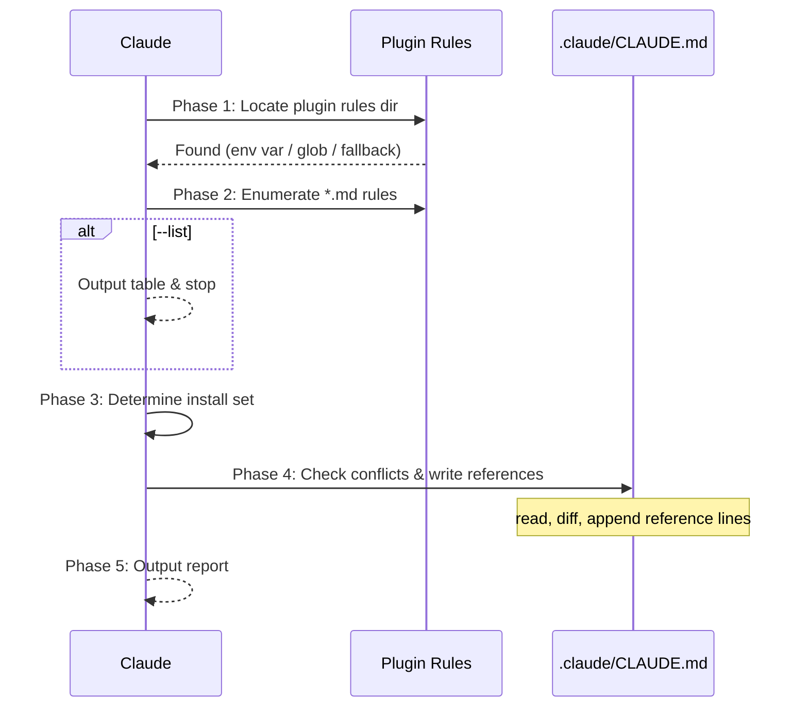

## Context

- Repo root: !`git rev-parse --show-toplevel`
- Existing local rules: !`ls .claude/rules/ 2>/dev/null || echo "(none)"`

## Task

Install references to dhpk plugin rules into the current project's `.claude/CLAUDE.md` so the project consistently pulls the shipped rules by path, even when this command is run standalone. This is a **path-reference install**, not a copy: the rule files themselves stay in the plugin; only reference lines are written into the consumer repo.

> **Note**: Installed references point at `${CLAUDE_PLUGIN_ROOT}/rules/<file>.md`. They only resolve while the `dhpk` plugin is loaded. For full command execution support without the plugin, also run `/install-hooks` and `/install-scripts` to set up local fallbacks.

### Workflow



### Arguments

```
$ARGUMENTS
```

| Argument | Description |
|----------|-------------|
| `--all` | Install references for all shipped rules |
| `--list` | List available rules without installing |
| `--dry-run` | Show what would be installed, no changes |
| `--force` | Overwrite an existing reference line that differs |
| `rule-names...` | Space-separated rule names (without .md extension) |

### Phase 1: Locate Plugin Rules Directory

Find the plugin's `rules/` directory using this priority:

1. **Direct env var** — if running as the plugin, `${CLAUDE_PLUGIN_ROOT}` points at the plugin root; the rules dir is `${CLAUDE_PLUGIN_ROOT}/rules/`.
2. **Glob search fallback** — if `${CLAUDE_PLUGIN_ROOT}` is unset, search known Claude plugin cache locations, short-circuit on first match:

   ```
   Glob: ~/.claude/plugins/**/dhpk/rules/execution-policy.md
   Glob: ${REPO_ROOT}/node_modules/dhpk/rules/execution-policy.md
   ```

3. **Plugin-relative fallback** — try reading `@rules/execution-policy.md` to confirm the plugin's rules are accessible. If readable, derive the rules directory by resolving the path returned (parent of `execution-policy.md`).
4. **Error** — if no rules directory found, report error and stop.

The `rules/` directory is the parent of whichever `execution-policy.md` is found first.

### Phase 2: Enumerate Available Rules

The plugin ships exactly 4 rules under `rules/`:

| Rule | Purpose |
|------|---------|
| `anti-rationalization.md` | Self-talk stop-loss reference for rationalization phrasings that precede skipping a mandatory reviewer / TDD / sentinel step |
| `execution-policy.md` | dhpk's default execution policy (dispatch, sentinels, anti-rationalization triggers) for projects that adopt the harness |
| `model-economics.md` | SSOT for which model tier each role runs on and the cost rules governing tier/effort choices |
| `tool-routing.md` | SSOT for code exploration tool choice (gitnexus / cx / claude-mem / Read / Grep) with graceful degradation |

If `--list` is specified, output this table and **stop**.

### Phase 3: Determine Installation Set

- `--all`: install all rules found in Phase 2
- Specific `rule-names`: install only those (validate they exist in the enumerated list)
- Neither: present the list and use AskUserQuestion to let the user select

### Phase 4: Check Conflicts and Write References

Use the repo root from Context (Phase 0) to build absolute paths. All paths below use `REPO_ROOT` from `git rev-parse --show-toplevel`. This is a path-reference install: the rule content is never copied — only a reference line pointing at `${CLAUDE_PLUGIN_ROOT}/rules/<name>.md` is written into `${REPO_ROOT}/.claude/CLAUDE.md`.

1. Read `${REPO_ROOT}/.claude/CLAUDE.md` (create with a minimal `# CLAUDE.md` header if it does not exist).

   If that target is a symlink, resolve it with `realpath ${REPO_ROOT}/.claude/CLAUDE.md` and Write to the resolved target; the Write tool refuses symlinks.

2. For each rule to install, the reference line is:

   ```
   - @${CLAUDE_PLUGIN_ROOT}/rules/<name>.md
   ```

   | Scenario | Default | `--force` |
   |----------|---------|-----------|
   | Reference line for `<name>.md` not present in `.claude/CLAUDE.md` | **Add** | **Add** |
   | Reference line already present, identical | **Skip** (already installed) | **Skip** |
   | A `@rules/<name>.md`-style reference exists but resolves elsewhere (e.g. local override) | **Skip** + warn as conflict | **Overwrite** (replace with the plugin path-reference) |

3. If `--dry-run`, output the plan table and **stop** (do not write any files).

4. Write the resulting reference lines under a `## Rules` section in `${REPO_ROOT}/.claude/CLAUDE.md`, appending the section if it does not already exist:

   ```markdown
   ## Rules

   - @${CLAUDE_PLUGIN_ROOT}/rules/execution-policy.md
   - @${CLAUDE_PLUGIN_ROOT}/rules/anti-rationalization.md
   - @${CLAUDE_PLUGIN_ROOT}/rules/model-economics.md
   - @${CLAUDE_PLUGIN_ROOT}/rules/tool-routing.md
   ```

   Only reference lines for the rules selected in Phase 3 are written.

### Phase 5: Output Report

## Output

```markdown
## Install Rules Report

**Source**: <plugin-rules-path>
**Target**: <repo-root>/.claude/CLAUDE.md

| Rule | Status |
|------|--------|
| execution-policy.md | ✅ Reference added |
| anti-rationalization.md | ✅ Reference added |
| model-economics.md | ⚠️ Skipped (conflict — local override exists) |
| tool-routing.md | ✅ Reference added |

**Installed**: N / **Skipped**: M / **Conflicts**: K

### Next Steps

- Review any skipped conflicts manually
- Referenced rules resolve via `${CLAUDE_PLUGIN_ROOT}` and are auto-loaded by Claude Code for this project whenever the `dhpk` plugin is loaded
```

## Examples

```bash
# List available rules
/install-rules --list

# Install all rules
/install-rules --all

# Install specific rules only
/install-rules execution-policy tool-routing

# Preview what would happen
/install-rules --all --dry-run

# Force overwrite existing rules
/install-rules --all --force
```
