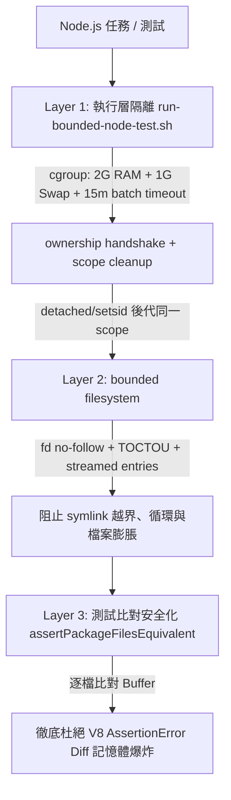

# Orca & Codex 頻繁崩潰問題調查與修復報告

## 1. 背景與初始疑點

- **發生現象**：在 WSL2 環境下，Orca GUI 視窗頻繁無預警關閉、Codex 與終端機連線中斷、WSL 發生重啟。
- **初始懷疑**：懷疑為 WSL 虛擬磁碟容量不足導致寫入失敗或程序崩潰。

---

## 2. 磁碟容量檢查實證（排除硬碟不足）

經由檢查 Linux 核心檔案系統與 Windows 宿主機掛載點：

| 掛載點 / 磁碟 | 總容量 | 已使用 | 剩餘可用 | 使用率 | 狀態評估 |
| :--- | :---: | :---: | :---: | :---: | :--- |
| **WSL 虛擬磁碟 (`/dev/sdd` -> `/`)** | 1007 GB | 185 GB | **772 GB** | 20% | **空間極為充足**，Inode 使用率僅 1% |
| **Windows C 槽 (`/mnt/c`)** | 465 GB | 442 GB | **23 GB** | 96% | 偏高但未耗盡，非本次 Crash 主因 |
| **Windows D/E 槽** | ~480 GB | ~128 GB | **349 GB** | ~27% | 空間充足 |

> **結論**：WSL 磁碟仍有 **772 GB 可用空間**，可 100% 排除「硬碟容量不足」導致當機的假設。

---

## 3. 核心崩潰記錄與真實根因分析

經由查詢 Linux 系統與核心日誌（`dmesg` / `journalctl`），確認今日所有崩潰均為 **Linux 核心 OOM Killer (Out Of Memory)** 強制處決程序所致：

### (1) 今日 OOM 崩潰時間線

- **08:56:12**：`app-orca-662238.scope: Failed with result 'oom-kill'`（Orca 崩潰）
- **11:47 ~ 12:13**：連續 6 次 `app-orca-*.scope` 因記憶體超載被 OOM Killer 終止
- **12:30:53**：`node-MainThread` 佔用 **21.8 GB RSS**，`init.scope` 被處決，WSL 全域重啟
- **13:06 ~ 13:23**：Orca 再次兩度遭遇 OOM Kill，隨後 `node-MainThread` 飆至 **23.6 GB RSS** 導致重啟
- **13:31:13**：`codex-code-mode` 經由沙盒執行的 Node 程序狂吞 **23.6 GB RAM + 5.9 GB Swap** 觸發全域 OOM
- **13:42 ~ 13:43**：執行測試時，`node-MainThread` 再次於 20 秒內飆至 **23.57 GB RSS** 觸發 OOM

### (2) 為什麼 Orca 與 Codex 會連鎖閃退？

1. `.wslconfig` 分配給 WSL2 的上限為 **24GB RAM + 8GB Swap**（總計 32GB 記憶體池）。
2. 當單一 Node.js 程序耗盡 30GB+ 虛擬記憶體時，Linux 核心啟動 OOM Killer。
3. 若該失控程序位在 Orca 的 Desktop Scope（`app-orca-*.scope`），systemd 會直接關閉整個 Orca 視窗；若位在全域 `init.scope`，systemd 會對該 Session 內的所有程序（`codex`、`orca`、`zsh`、`bun`、`python`）發送 `SIGKILL`，造成整台 WSL 重啟。

### (3) 吸血鬼程序的引爆點（Bug 核心機理）

經二分法隔離與即時除錯，抓到了觸發記憶體暴衝的確切點：
1. 先前執行 Python 3.14 時，在 `plugins/dhpk-agent/` 遺留了未追蹤的 `.pyc` 與 `__pycache__` 檔案。
2. 套件建置測試比對產出目錄（302 檔，已過濾 pyc）與基準目錄（312 檔，含 pyc）時發生不一致。
3. 測試使用了 Node.js 原生的物件比對：
   ```javascript
   assert.deepStrictEqual(outFiles, fixtureFiles); // 內含 300+ 個 File Buffer 物件
   ```
4. **觸發 Node.js / V8 核心缺陷（AssertionError Buffer Diff Explosion）**：
   當比對失敗時，Node.js 試圖在記憶體中遞迴序列化並生成 300 多個大型二進位 Buffer 的彩色終端機差異字串（Diff），產生**指數級記憶體配置**，在 **20 秒內狂向作業系統申請 24GB+ 記憶體**，瞬間擊潰 WSL2。

---

## 4. 全專案其他腳本交叉審查結果

我們進一步排查了專案中所有涉及檔案遞迴走訪、指紋計算與測試聚合的腳本，發現並修復了以下潛在風險：

| 檔案 / 模組 | 原有潛在風險 | 危害等級 | 修正措施 |
| :--- | :--- | :---: | :--- |
| `scripts/lib/agent-plugin-package.js` | 遞迴走訪無 Symlink 循環偵測與深度限制 | **高** | 加入 `visited` 集合、`depth <= 64`、檔案數 `<= 20k`、位元組 `<= 128MB` 上限保護。 |
| `scripts/lib/asset-inventory.js` | `walkFiles` 遞迴無深度與循環保護，且會遍歷 `node_modules` 與 `__pycache__` | **中** | 加入 `visited` 集合、`depth <= 64` 與忽略目錄清單。 |
| `scripts/lib/agy-plugin-package.js` | `copyDirectory` 打包時未排除 `.pyc`，會將暫態 bytecode 複製進套件 | **中** | 在遍歷層加入 `__pycache__` 與 `.pyc` 過濾。 |
| `scripts/lib/codex-native-package.js`<br>`scripts/lib/cursor-plugin-package.js` | 指紋計算未過濾 `.pyc`，外部 Python 執行會導致指紋庫漂移 | **中** | `fingerprintDir` 與 `fingerprintPath` 全面加入 `__pycache__` / `.pyc` 忽略。 |
| `tests/run-all.js` | 批次測試執行器未設 Timeout 與記憶體上限 | **中** | 加入單檔 60 秒 Timeout 與預設 `--max-old-space-size=2048`。 |
| `scripts/lib/bounded-filesystem.js` | `readFileSync` 與 `readdirSync` 可能在讀取前一次配置大量記憶體，且存在 symlink / TOCTOU 風險 | **高** | 以 `opendirSync` 逐項計數；共用 depth/file/entry/byte budget；`O_NOFOLLOW` descriptor 分段讀取並以 `fstat` 驗證身份與最終大小。 |
| `scripts/lib/codex-native-package.js`<br>`scripts/lib/cursor-plugin-package.js` | 多個選取 skill 各自套用上限，聚合輸出仍可能超出總量；指紋可追 symlink | **高** | 全 projection 共用 traversal budget；輸出與 receipt 也計入 bytes；native/Cursor fingerprint 對 root、ancestor、entry symlink fail-closed。 |
| `scripts/ci/run-bounded-node-test.sh` | 只終止直接 timeout process，detached/`setsid` 後代可能存活；scope 查詢失敗可能被誤判為清理完成 | **高** | 使用 UUID + Description ownership 的 transient cgroup scope；payload 先等待 ownership readiness handshake；每個退出路徑 kill/stop 全 scope，查詢失敗或仍 active 一律回傳 containment failure。 |
| `scripts/release/consumer-gate.js` | consumer fingerprint 追蹤未核准外部 symlink，且 surface root 先列舉後驗證 | **高** | 每個節點 canonicalize 並限制在 project/repository approved roots；kind root 在 `readdir` 前驗證，native surface 拒絕 symlink ancestor。 |
| `scripts/ci/_lib/codex-runtime.js`<br>`scripts/release/consumer-gate.js` | projection symlink / reference 讀取可能越界或產生無界 listing | **中** | 只讀 canonical roots 內的 projection；所有目錄讀取改 bounded helper，越界轉成可追蹤診斷。 |

---

## 5. 實施之多層防禦修正



1. **執行層隔離**：新增 `scripts/ci/run-bounded-node-test.sh` 與測試 `tests/run-bounded-node-test.test.js`，將記憶體上限硬性限制在 2GB；完整測試批次有 15 分鐘上限，而 `tests/run-all.js` 對每個子測試維持 60 秒上限，超時自動中斷。CI 預設拒絕未驗證 cgroup；明確 fallback 仍只提供 virtual-memory 上限並標示 descendant containment 不可驗證。Transient scope 使用隨機 ownership marker，payload 在 marker 建立前不會執行，scope state query 失敗也不會被當作「已清理」。
2. **測試比對演算法安全化**：在 `tests/gen-agent-plugin-package.test.js` 與 `tests/gen-codex-native-package.test.js` 導入 `assertPackageFilesEquivalent()`，出錯時只報告檔名與單檔大小，不讓 Node.js 產生大型 Buffer diff。
3. **全面清理與隔離 Python 快取**：清除全專案遺留之 `.pyc` / `__pycache__`，並在所有指紋與打包腳本中建立永久過濾機制。
4. **讀取與投影預算**：所有已審查的 package、inventory、consumer、projection 腳本共用有限 traversal budget；bytes 以 descriptor 分段讀取並驗證檔案身份，避免單檔、單目錄或跨 skill 聚合時再次形成大型配置尖峰。

---

## 6. 驗證與驗收結果

1. **宣告與腳本測試覆蓋檢查**：
   ```bash
   ./scripts/ci/run-bounded-node-test.sh node scripts/ci/catalog.js --check
   # 輸出: PASS [catalog]: all exact numeric claims match reality; all scripts have dedicated tests (0 uncovered).
   ```
2. **全專案單元測試（目前 215 個測試檔）**：
   ```text
   PASS: 215/215 test files passed (100% 通過率，0 失敗)
   ```
3. **系統穩定度監控**：
   - 本次完整測試由 `run-bounded-node-test.sh` 執行，實際 cgroup 證據為 `memory.max=2147483648`、`memory.swap.max=1073741824`；未觀察到測試程序越過上限或被 OOM 終止。
   - bounded wrapper regression 15/15、consumer surface gate 15/15、Codex native package 16/16、Cursor package 18/18；`run-codex` timeout fixtures 連續重跑 3 次皆為 22/22。
   - 本次未重新採集宿主機 RSS 峰值或 `dmesg` 全日紀錄，因此不把「<300MB」或「全日 0 次 OOM」當作本次驗證結論；那些數字仍屬原始調查紀錄。
