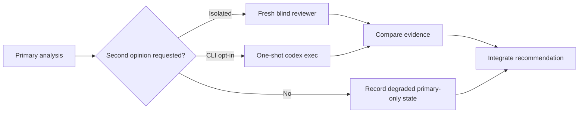

# Independent Comparison Guide

## Core Principle

The primary model owns the feasibility analysis. An independent comparison is
an additive, explicitly requested perspective and must not silently replace the
primary recommendation.

## When to Compare

| Timing | Action |
| --- | --- |
| Before analysis | Dispatch a fresh isolated subagent to enumerate and critique possibilities |
| When a new idea emerges | Send the new idea in a clean prompt to an isolated reviewer |
| After options form | Ask the reviewer to evaluate the proposed design |
| Comparing proposals | Ask the reviewer for a side-by-side comparison |
| Any uncertainty | Record the question and request an independent assessment rather than guessing |

## Available Paths

| Path | Purpose | Requirement |
| --- | --- | --- |
| Isolated general-purpose subagent | Blind enumeration, critique, or comparison | Fresh read-only context; never pass the primary conclusion |
| `--second-opinion=codex-exec` | Additional one-shot CLI opinion | Explicit caller opt-in; pass a self-contained prompt and record the result separately |
| `--no-codex` | Primary-only feasibility study | Report the degraded primary-only state; do not claim independent comparison |

## Comparison Flow



## Clean Reviewer Prompt

```text
# Independent feasibility comparison
Requirement: <requirement summary>
Constraints: <technical, business, resource, compatibility constraints>
Options: <option descriptions and quantified assessments>

Evaluate each option independently. Identify feasibility, effort, risk,
extensibility, maintenance cost, assumptions, and open questions. Do not assume
a prior recommendation. Return evidence and a bounded recommendation.
```

The prompt must not include the primary model's conclusion. Keep reviewer
evidence separate until the final comparison and record whether the reviewer
ran, failed, or was not requested.

## Comparison Principles

| Principle | Description |
| --- | --- |
| Independent evidence | Use a fresh context and compare evidence, not confidence |
| Bounded critique | Challenge assumptions while staying within the stated constraints |
| Explicit continuity | A new round receives a new evidence packet; do not imply a persistent thread |
| Honest outcome | A missing reviewer is degraded primary-only evidence, not independent confirmation |
| Recorded decision | Preserve agreements, disagreements, trade-offs, and the selected backup |

## Prohibited Behaviors

- Claiming an independent comparison when no reviewer ran.
- Sending the primary recommendation to a blind reviewer before it responds.
- Treating a failed optional reviewer as evidence of feasibility.
- Restoring a hidden legacy transport when an optional reviewer is unavailable.
